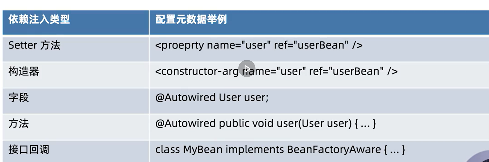

### ObjectFactory 和 BeanFactory 的区别
ObjectFactory和BeanFactory都提供了依赖查找的功能

不过ObjectFactory关注的是一个或是一种类型的Bean的依赖查找,并且本身不具有依赖查找的能力,
能力则有BeanFactory输出

BeanFactory提供了单一类型的,集合类型,层次性多方面的依赖查找方式

### BeanFactory.getBean是否是线程安全的
线程安全的

### 依赖注入模式和类型
#### 手动模式-配置或者编程的方式
- XML资源配置元信息
- Java注解配置元信息
- Api配置元信息
#### 自动模式
- Autowiring(自动绑定)
#### 依赖注入类型

